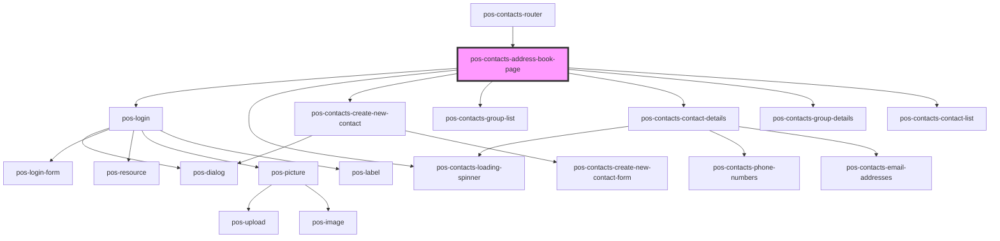

# pos-contacts-address-book-page

<!-- Auto Generated Below -->

## Properties

| Property           | Attribute | Description | Type             | Default     |
| ------------------ | --------- | ----------- | ---------------- | ----------- |
| `contactsModule`   | --        |             | `ContactsModule` | `undefined` |
| `uri` _(required)_ | `uri`     |             | `string`         | `undefined` |

## Dependencies

### Used by

 - [pos-contacts-router](../router)

### Depends on

- pos-login
- [pos-contacts-loading-spinner](../loading-spinner)
- [pos-contacts-create-new-contact](../create-new-contact)
- [pos-contacts-group-list](../group-list)
- [pos-contacts-contact-details](../contact-details)
- [pos-contacts-group-details](../contact-details/group-details)
- [pos-contacts-contact-list](../contact-list)

### Graph

----------------------------------------------

*Built with [StencilJS](https://stenciljs.com/)*
