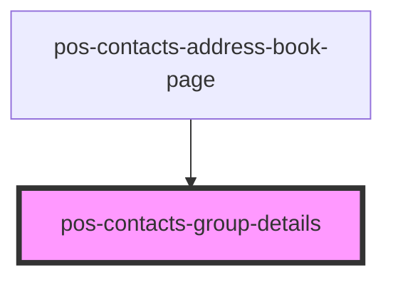

# pos-contacts-group-details

<!-- Auto Generated Below -->

## Properties

| Property                      | Attribute | Description | Type             | Default     |
| ----------------------------- | --------- | ----------- | ---------------- | ----------- |
| `contactsModule` _(required)_ | --        |             | `ContactsModule` | `undefined` |
| `uri` _(required)_            | `uri`     |             | `string`         | `undefined` |

## Dependencies

### Used by

 - [pos-contacts-address-book-page](../../address-book-page)

### Graph

----------------------------------------------

*Built with [StencilJS](https://stenciljs.com/)*
