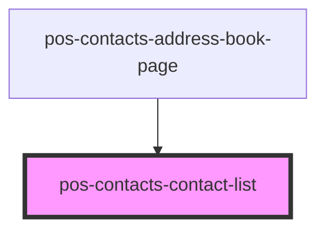

# pos-contacts-contact-list

<!-- Auto Generated Below -->

## Properties

| Property                | Attribute | Description | Type        | Default     |
| ----------------------- | --------- | ----------- | ----------- | ----------- |
| `contacts` _(required)_ | --        |             | `Contact[]` | `undefined` |

## Events

| Event                              | Description | Type                   |
| ---------------------------------- | ----------- | ---------------------- |
| `pod-os-contacts:contact-selected` |             | `CustomEvent<Contact>` |

## Dependencies

### Used by

 - [pos-contacts-address-book-page](../address-book-page)

### Graph

----------------------------------------------

*Built with [StencilJS](https://stenciljs.com/)*
