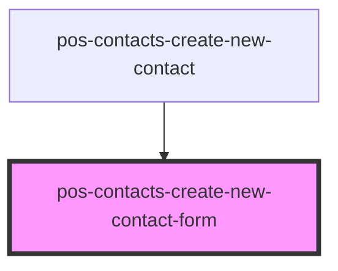

# pos-contacts-create-new-contact-form

<!-- Auto Generated Below -->

## Properties

| Property                      | Attribute          | Description | Type     | Default     |
| ----------------------------- | ------------------ | ----------- | -------- | ----------- |
| `addressBookUri` _(required)_ | `address-book-uri` |             | `string` | `undefined` |

## Events

| Event                             | Description | Type                   |
| --------------------------------- | ----------- | ---------------------- |
| `pod-os-contacts:contact-created` |             | `CustomEvent<Contact>` |
| `pod-os:error`                    |             | `CustomEvent<any>`     |
| `pod-os:module`                   |             | `CustomEvent<any>`     |

## Dependencies

### Used by

 - [pos-contacts-create-new-contact](../create-new-contact)

### Graph

----------------------------------------------

*Built with [StencilJS](https://stenciljs.com/)*
