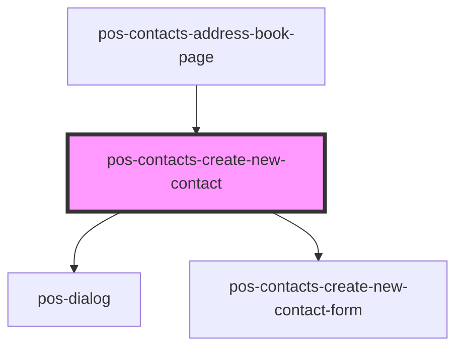

# pos-contacts-create-new-contact

<!-- Auto Generated Below -->

## Properties

| Property                      | Attribute          | Description | Type     | Default     |
| ----------------------------- | ------------------ | ----------- | -------- | ----------- |
| `addressBookUri` _(required)_ | `address-book-uri` |             | `string` | `undefined` |

## Dependencies

### Used by

 - [pos-contacts-address-book-page](../address-book-page)

### Depends on

- pos-dialog
- [pos-contacts-create-new-contact-form](../create-new-contact-form)

### Graph

----------------------------------------------

*Built with [StencilJS](https://stenciljs.com/)*
