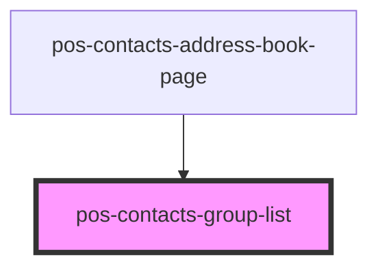

# pos-contacts-group-list

<!-- Auto Generated Below -->

## Properties

| Property | Attribute | Description | Type      | Default     |
| -------- | --------- | ----------- | --------- | ----------- |
| `groups` | --        |             | `Group[]` | `undefined` |

## Events

| Event                            | Description | Type                 |
| -------------------------------- | ----------- | -------------------- |
| `pod-os-contacts:group-selected` |             | `CustomEvent<Group>` |

## Dependencies

### Used by

 - [pos-contacts-address-book-page](../address-book-page)

### Graph

----------------------------------------------

*Built with [StencilJS](https://stenciljs.com/)*
