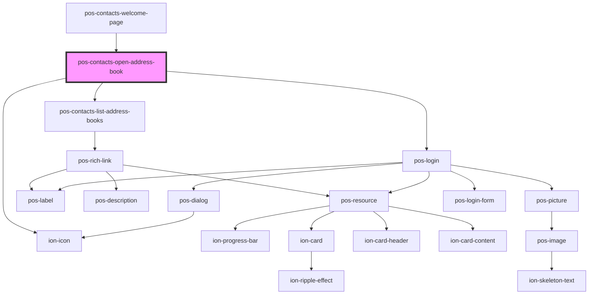

# pos-contacts-open-address-book

<!-- Auto Generated Below -->

## Events

| Event                               | Description | Type                  |
| ----------------------------------- | ----------- | --------------------- |
| `pod-os-contacts:open-address-book` |             | `CustomEvent<string>` |

## Dependencies

### Used by

 - [pos-contacts-welcome-page](../welcome-page)

### Depends on

- [pos-contacts-list-address-books](../list-address-books)
- pos-login
- ion-icon

### Graph

----------------------------------------------

*Built with [StencilJS](https://stenciljs.com/)*
