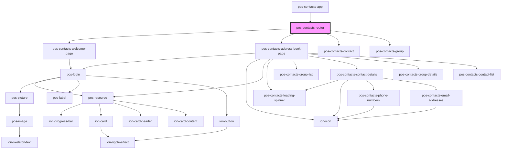

# pos-contacts-router

<!-- Auto Generated Below -->

## Events

| Event         | Description | Type               |
| ------------- | ----------- | ------------------ |
| `pod-os:init` |             | `CustomEvent<any>` |

## Dependencies

### Used by

 - [pos-contacts-app](..)

### Depends on

- [pos-contacts-welcome-page](../welcome-page)
- [pos-contacts-address-book-page](../address-book-page)
- [pos-contacts-contact](..)
- [pos-contacts-group](..)

### Graph

----------------------------------------------

*Built with [StencilJS](https://stenciljs.com/)*
