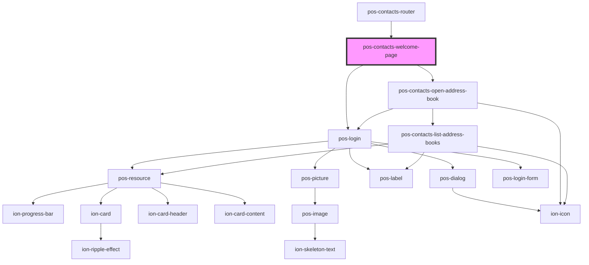

# pos-contacts-welcome-page

<!-- Auto Generated Below -->

## Dependencies

### Used by

 - [pos-contacts-router](../router)

### Depends on

- pos-login
- [pos-contacts-open-address-book](../open-address-book)

### Graph

----------------------------------------------

*Built with [StencilJS](https://stenciljs.com/)*
