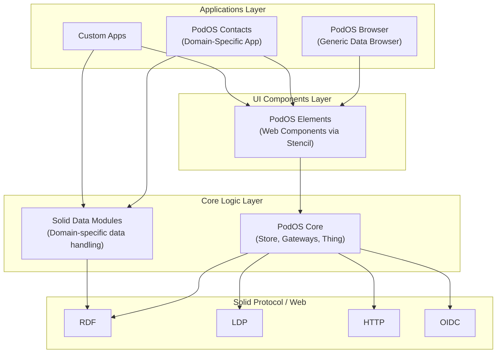
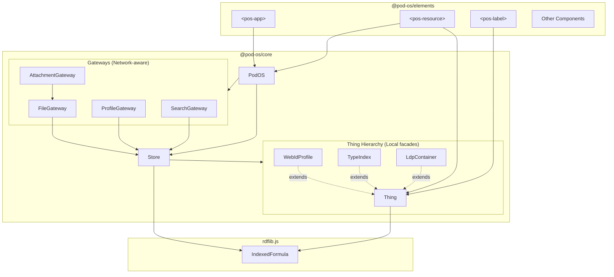
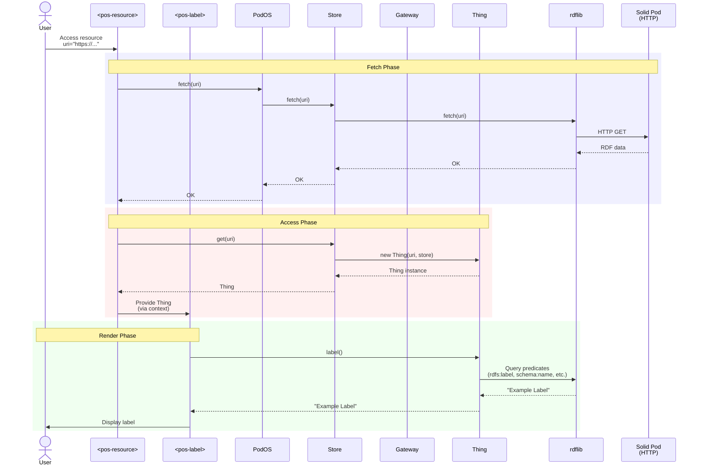

# PodOS Architecture

## Design Principles

### 1. Mobile-First & Accessibility

Unlike its spiritual predecessor SolidOS, PodOS is built from the ground up with
mobile-first UX and accessibility as primary concerns. This reflects the reality
that many users work from phones or need to access their data while on the go.

**Architectural implications:**

- UI components are touch-friendly and responsive
- Network handling accounts for unreliable connections
- Offline-first capabilities with caching and graceful degradation
- Service worker support for Progressive Web App features

### 2. Framework Independence

PodOS uses **Web Components** (Custom Elements) to ensure it works with any
framework or no framework at all. This makes PodOS accessible to anyone who
knows HTML and JavaScript.

**Key technology choice:** Stencil.js compiles components to standard web
components. Stencil exists only at build time for developer experience – it
ships no runtime framework overhead to users.

### 3. Modularity

PodOS is built as a modular system with clear package boundaries:

**@pod-os/core** handles generic Solid operations:

- RDF data manipulation
- LDP container operations
- Basic CRUD operations
- Core Solid Protocol compliance

**@pod-os/elements** provides the UI layer:

- Framework-independent web components
- Built with Stencil.js (compile-time only)
- Reusable across any application

**Domain-specific modules** follow client-to-client specifications:

- Contacts, recipes, events, etc.
- Each domain gets its own module when needed

**Cross-cutting concerns** stay in core:

- generic things and universal properties like labels and descriptions
- Solid concepts like WebID profile
- Attachments and pictures (anything can have these)
- Search and indexing
- Authentication and sessions

## Architecture Layers

The following diagram illustrates PodOS's layered architecture, showing how
applications and UI components sit on top of core logic, which communicates with
Solid Protocol standards. This separation ensures framework independence and
clear responsibility boundaries between layers.



**PodOS Elements** are framework-independent with no RDF knowledge, shipping as
standard Custom Elements.

**PodOS Core** handles all RDF/Solid/networking and provides generic Solid
operations.

## Elements Layer (Web Components)

Framework-independent UI components that:

- **Know nothing about RDF or Solid protocols** - They work with simple
  JavaScript objects and strings
- **Built with Stencil.js** - Compile-time only tool for developer experience,
  ships standard web components
- **Use context to share data** - Parent components like `<pos-resource>`
  provide data to children
- **Call PodOS core or modules to query or update data** - Query data from the
  local store or perform network operations

### Key Elements

- **`<pos-app>`** - Root application wrapper providing PodOS instance to all
  children
- **`<pos-resource>`** - Loads a resource from the Pod and provides Thing
  instance to children
- **`<pos-label>`**, **`<pos-description>`**, **`<pos-picture>`** - Display
  common resource data
- **`<pos-login>`** - Authentication UI

### Context Pattern

Elements use a hierarchical context pattern:

```html
<pos-app>
  <!-- Provides PodOS instance -->
  <pos-resource uri="https://...">
    <!-- Fetches resource, provides Thing -->
    <pos-label />
    <!-- Reads from Thing context -->
  </pos-resource>
</pos-app>
```

## Core Layer Architecture

The core layer handles all RDF, Solid Protocol, and networking operations. It's
organized around three main concepts: Store, Gateways, and Thing hierarchy.

### Component Relationships

This diagram shows the internal structure of the core layer and how UI elements
interact with it. Gateways handle network-aware operations, Thing classes
provide read-only facades over the RDF store, and elements consume data through
simple interfaces without knowledge of RDF internals.



**Store** is the central RDF store wrapping rdflib IndexedFormula and is
network-aware.

**Thing Hierarchy** provides base facades over the store with generic query
methods: `label()`, `description()`, `picture()`, `types()`.

### Separation of Concerns within Core

The core layer enforces clear boundaries:

**Network-aware components** (allowed to make requests):

- Store
- Gateway classes

**Local-only components** (read-only facade over store, no network):

- Thing class and subclasses (query only, never call Gateways/Store for writes)

**Key principle:** Thing is read-only and local. UI components call Gateways
directly for all write/mutation and network operations (fetching, creating,
updating, deleting). Thing only provides query methods for reading data from the
in-memory store.

### Core Abstractions

#### Store

Central RDF data store wrapping rdflib's IndexedFormula. Responsible for:

- Fetching resources from Pods (network-aware)
- Maintaining the in-memory RDF graph
- Providing access to Thing instances

#### Gateways

Use-case-specific coordinators for complex operations:

- **ProfileGateway**: User profile and preferences access
- **FileGateway**: File upload and management
- **AttachmentGateway**: Linking files to things
- **SearchGateway**: Building and querying label indexes

Gateways are called for all write and network operations. They orchestrate
between Store (for RDF operations) and network operations (like file uploads,
PATCH requests to update data).

#### Thing

A facade over the RDF store providing simple, developer-friendly query methods.
Thing and its subclasses are **local-only and read-only**. They:

- Never make network requests
- Only query the in-memory store
- Never call Store or Gateway methods for writes
- Do not perform mutations or updates

For creating, updating, or deleting data, UI components must call PodOS instance
methods or Gateways directly.

#### Thing Subclasses

Domain-specific facades adding specialized query methods, like:

- **WebIdProfile**: `getPreferencesFile()`, `getPublicTypeIndex()`,
  `getPrivateLabelIndexes()`
- **TypeIndex**: `listAll()` for type registrations
- **LdpContainer**: Container-specific operations

## Data Flow

This sequence diagram traces a complete request lifecycle, from user interaction
through resource fetching, Thing instantiation, and rendering. It demonstrates
the clear separation between network operations (Fetch Phase), data access
(Access Phase), and UI rendering (Render Phase).



**Key architectural points:**

- Elements know nothing about RDF
- Thing facade hides RDF complexity
- Network calls only happen in Fetch phase

### Flow Summary

1. **Fetch Phase**: `<pos-resource>` calls `PodOS.fetch(uri)` → Store fetches
   from Pod via HTTP
2. **Access Phase**: `<pos-resource>` calls `Store.get(uri)` → Returns Thing
   instance
3. **Render Phase**: Child elements like `<pos-label>` call `Thing.label()` →
   Queries in-memory RDF store

## Modularity & Ecosystem Integration

### Current State (Work in Progress)

PodOS's modularity strategy is evolving:

**Data Handling:**

- **Solid Data Modules** (e.g., `@solid-data-modules/contacts-rdflib`) handle
  domain-specific data operations
- These are framework-agnostic, not PodOS-specific
- PodOS core is compatible with them but doesn't own them
- Each module has its own abstractions (not necessarily Store/Gateway/Thing
  pattern)

**UI Components:**

- Domain-specific elements could live in separate packages (future work)
- Currently, apps like Contacts bundle application + domain-specific components
  together

**Core vs. Modules:**

- **@pod-os/core**: Generic Solid operations, cross-cutting concerns
- **@pod-os/service-worker**: PWA utilities
- **Future @pod-os/[domain]**: Domain-specific elements and integration

### Integration Pattern

When PodOS needs domain-specific functionality:

1. Use existing Solid Data Modules for data operations
2. Create domain-specific elements if needed
3. Combine in an application or module package

Example: The Contacts app uses `@solid-data-modules/contacts-rdflib` for data
handling and provides its own UI components.

## Design Evolution

The architecture has evolved to address scalability concerns:

**Early design:**

- Store handled everything (RDF + all network operations)
- Single class became increasingly complex

**Current design:**

- Store focuses on RDF operations and basic fetching
- Gateway classes handle domain-specific network operations
- Clear separation between network-aware and local-only code

## Further Reading

- [Decision: Separate PodOS Elements and Core](../decisions/0002-separate-pod-os-elements-and-core.md)
- [PodOS Elements Reference](https://pod-os.org/reference/elements/)
- [PodOS Core Reference](https://pod-os.org/reference/core/)
- [Solid Data Modules](https://github.com/solid-contrib/data-modules)
- [Using Solid Data Modules with PodOS](https://pod-os.org/tutorials/using-solid-data-modules/)
