# pos-app-browser

<!-- Auto Generated Below -->

## Dependencies

### Depends on

- [pos-app](../../components/pos-app)
- ion-header
- ion-toolbar
- ion-title
- [pos-login](../../components/pos-login)
- ion-content
- [pos-router](../../components/pos-router)
- ion-footer

### Graph

```mermaid
graph TD;
  pos-app-browser --> pos-app
  pos-app-browser --> ion-header
  pos-app-browser --> ion-toolbar
  pos-app-browser --> ion-title
  pos-app-browser --> pos-login
  pos-app-browser --> ion-content
  pos-app-browser --> pos-router
  pos-app-browser --> ion-footer
  pos-app --> ion-app
  pos-login --> pos-resource
  pos-login --> pos-picture
  pos-login --> pos-label
  pos-login --> ion-button
  pos-resource --> ion-progress-bar
  pos-resource --> ion-card
  pos-resource --> ion-card-header
  pos-resource --> ion-card-content
  ion-card --> ion-ripple-effect
  pos-picture --> pos-image
  pos-image --> ion-skeleton-text
  pos-image --> ion-icon
  ion-button --> ion-ripple-effect
  pos-router --> pos-navigation-bar
  pos-router --> pos-resource
  pos-router --> pos-type-router
  pos-navigation-bar --> ion-searchbar
  ion-searchbar --> ion-icon
  pos-type-router --> pos-app-rdf-document
  pos-type-router --> pos-app-image-viewer
  pos-type-router --> pos-app-generic
  pos-app-rdf-document --> ion-grid
  pos-app-rdf-document --> ion-row
  pos-app-rdf-document --> ion-col
  pos-app-rdf-document --> pos-subjects
  pos-app-rdf-document --> ion-card
  pos-app-rdf-document --> ion-card-header
  pos-app-rdf-document --> ion-card-title
  pos-app-rdf-document --> pos-label
  pos-app-rdf-document --> pos-type-badges
  pos-app-rdf-document --> pos-literals
  pos-subjects --> pos-rich-link
  pos-subjects --> ion-list
  pos-rich-link --> pos-resource
  pos-rich-link --> ion-item
  pos-rich-link --> ion-label
  pos-rich-link --> pos-label
  pos-rich-link --> pos-description
  ion-item --> ion-icon
  ion-item --> ion-ripple-effect
  pos-type-badges --> ion-badge
  pos-type-badges --> ion-icon
  pos-literals --> ion-item-group
  pos-literals --> ion-item-divider
  pos-literals --> ion-label
  pos-literals --> ion-item
  pos-literals --> ion-list
  pos-app-image-viewer --> ion-grid
  pos-app-image-viewer --> ion-row
  pos-app-image-viewer --> ion-col
  pos-app-image-viewer --> pos-image
  pos-app-image-viewer --> ion-card
  pos-app-image-viewer --> ion-card-header
  pos-app-image-viewer --> ion-card-title
  pos-app-image-viewer --> pos-label
  pos-app-image-viewer --> pos-type-badges
  pos-app-image-viewer --> pos-literals
  pos-app-generic --> ion-grid
  pos-app-generic --> ion-row
  pos-app-generic --> ion-col
  pos-app-generic --> ion-card
  pos-app-generic --> ion-card-header
  pos-app-generic --> pos-type-badges
  pos-app-generic --> pos-picture
  pos-app-generic --> ion-card-title
  pos-app-generic --> pos-label
  pos-app-generic --> ion-card-content
  pos-app-generic --> pos-description
  pos-app-generic --> pos-literals
  pos-app-generic --> pos-relations
  pos-app-generic --> pos-reverse-relations
  pos-relations --> ion-item-group
  pos-relations --> ion-item-divider
  pos-relations --> ion-label
  pos-relations --> pos-rich-link
  pos-relations --> ion-list
  pos-reverse-relations --> ion-item-group
  pos-reverse-relations --> ion-item-divider
  pos-reverse-relations --> ion-label
  pos-reverse-relations --> pos-rich-link
  pos-reverse-relations --> ion-list
  style pos-app-browser fill:#f9f,stroke:#333,stroke-width:4px
```

----------------------------------------------

*Built with [StencilJS](https://stenciljs.com/)*
