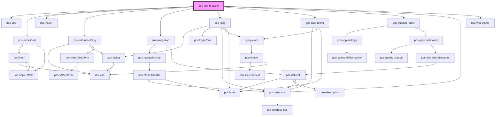

# pos-app-browser

<!-- Auto Generated Below -->

## Properties

| Property                 | Attribute                  | Description                                                                                                                                                                          | Type                    | Default        |
| ------------------------ | -------------------------- | ------------------------------------------------------------------------------------------------------------------------------------------------------------------------------------ | ----------------------- | -------------- |
| `mode`                   | `mode`                     | The mode the app is running in:  - standalone: use this when you deploy it as a standalone web application - pod: use this when you host this app as a default interface for you pod | `"pod" \| "standalone"` | `'standalone'` |
| `restorePreviousSession` | `restore-previous-session` |                                                                                                                                                                                      | `boolean`               | `false`        |

## Dependencies

### Depends on

- [pos-app](../../components/pos-app)
- [pos-error-toast](../../components/pos-error-toast)
- [pos-router](../../components/pos-router)
- [pos-add-new-thing](../../components/pos-add-new-thing)
- [pos-navigation](../../components/pos-navigation)
- [pos-login](../../components/pos-login)
- [pos-user-menu](../../components/pos-user-menu)
- [pos-internal-router](../../components/pos-internal-router)
- [pos-resource](../../components/pos-resource)
- [pos-type-router](../../components/pos-type-router)

### Graph

----------------------------------------------

*Built with [StencilJS](https://stenciljs.com/)*
