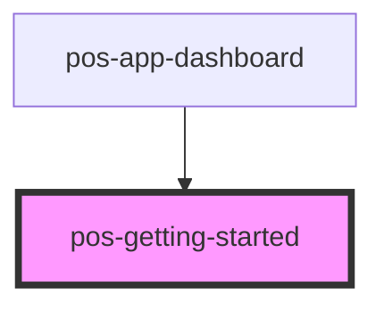

# pos-getting-started

<!-- Auto Generated Below -->

## Events

| Event          | Description | Type                |
| -------------- | ----------- | ------------------- |
| `pod-os:login` |             | `CustomEvent<void>` |

## Dependencies

### Used by

 - [pos-app-dashboard](..)

### Graph

----------------------------------------------

*Built with [StencilJS](https://stenciljs.com/)*
