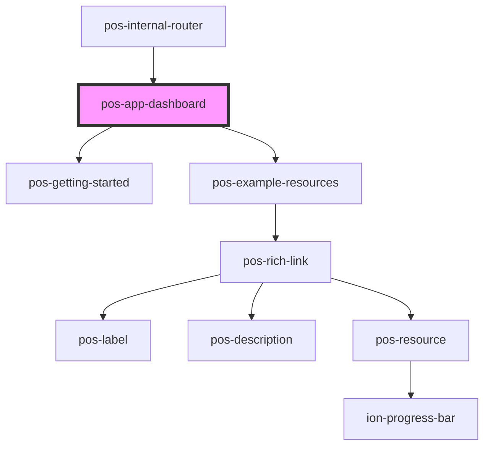

# pos-app-dashboard

<!-- Auto Generated Below -->

## Dependencies

### Used by

 - [pos-internal-router](../../components/pos-internal-router)

### Depends on

- [pos-getting-started](pos-getting-started)
- [pos-example-resources](pos-example-resources)

### Graph

----------------------------------------------

*Built with [StencilJS](https://stenciljs.com/)*
