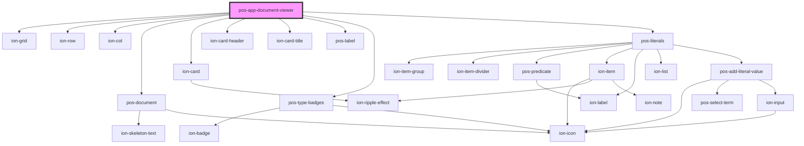

# pos-app-document-viewer

<!-- Auto Generated Below -->

## Events

| Event             | Description | Type               |
| ----------------- | ----------- | ------------------ |
| `pod-os:resource` |             | `CustomEvent<any>` |

## Dependencies

### Depends on

- ion-grid
- ion-row
- ion-col
- [pos-document](../../components/pos-document)
- ion-card
- ion-card-header
- ion-card-title
- [pos-label](../../components/pos-label)
- [pos-type-badges](../../components/pos-type-badges)
- [pos-literals](../../components/pos-literals)

### Graph

----------------------------------------------

*Built with [StencilJS](https://stenciljs.com/)*
