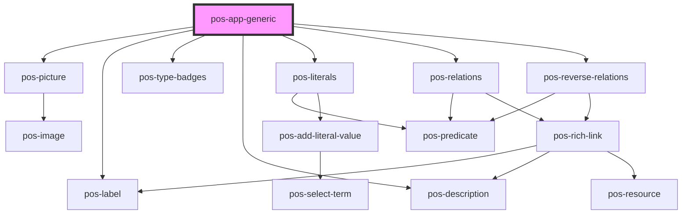

# pos-app-generic

<!-- Auto Generated Below -->

## Dependencies

### Depends on

- [pos-picture](../../components/pos-picture)
- [pos-label](../../components/pos-label)
- [pos-type-badges](../../components/pos-type-badges)
- [pos-description](../../components/pos-description)
- [pos-literals](../../components/pos-literals)
- [pos-relations](../../components/pos-relations)
- [pos-reverse-relations](../../components/pos-reverse-relations)

### Graph

----------------------------------------------

*Built with [StencilJS](https://stenciljs.com/)*
