# pos-app-generic

<!-- Auto Generated Below -->

## Dependencies

### Depends on

- ion-grid
- ion-row
- ion-col
- ion-card
- ion-card-header
- [pos-type-badges](../../components/pos-type-badges)
- [pos-picture](../../components/pos-picture)
- ion-card-title
- [pos-label](../../components/pos-label)
- ion-card-content
- [pos-description](../../components/pos-description)
- [pos-literals](../../components/pos-literals)
- [pos-relations](../../components/pos-relations)
- [pos-reverse-relations](../../components/pos-reverse-relations)

### Graph

```mermaid
graph TD;
  pos-app-generic --> ion-grid
  pos-app-generic --> ion-row
  pos-app-generic --> ion-col
  pos-app-generic --> ion-card
  pos-app-generic --> ion-card-header
  pos-app-generic --> pos-type-badges
  pos-app-generic --> pos-picture
  pos-app-generic --> ion-card-title
  pos-app-generic --> pos-label
  pos-app-generic --> ion-card-content
  pos-app-generic --> pos-description
  pos-app-generic --> pos-literals
  pos-app-generic --> pos-relations
  pos-app-generic --> pos-reverse-relations
  ion-card --> ion-ripple-effect
  pos-type-badges --> ion-badge
  pos-type-badges --> ion-icon
  pos-picture --> pos-image
  pos-image --> ion-skeleton-text
  pos-image --> ion-icon
  pos-literals --> ion-item-group
  pos-literals --> ion-item-divider
  pos-literals --> ion-label
  pos-literals --> ion-item
  pos-literals --> ion-list
  pos-literals --> pos-add-literal-value
  ion-item --> ion-icon
  ion-item --> ion-ripple-effect
  ion-item --> ion-note
  pos-add-literal-value --> ion-icon
  pos-add-literal-value --> pos-select-term
  pos-add-literal-value --> ion-input
  ion-input --> ion-icon
  pos-relations --> ion-item-group
  pos-relations --> ion-item-divider
  pos-relations --> ion-label
  pos-relations --> pos-rich-link
  pos-relations --> ion-list
  pos-rich-link --> pos-resource
  pos-rich-link --> ion-item
  pos-rich-link --> ion-label
  pos-rich-link --> pos-label
  pos-rich-link --> pos-description
  pos-resource --> ion-progress-bar
  pos-resource --> ion-card
  pos-resource --> ion-card-header
  pos-resource --> ion-card-content
  pos-reverse-relations --> ion-item-group
  pos-reverse-relations --> ion-item-divider
  pos-reverse-relations --> ion-label
  pos-reverse-relations --> pos-rich-link
  pos-reverse-relations --> ion-list
  style pos-app-generic fill:#f9f,stroke:#333,stroke-width:4px
```

----------------------------------------------

*Built with [StencilJS](https://stenciljs.com/)*
