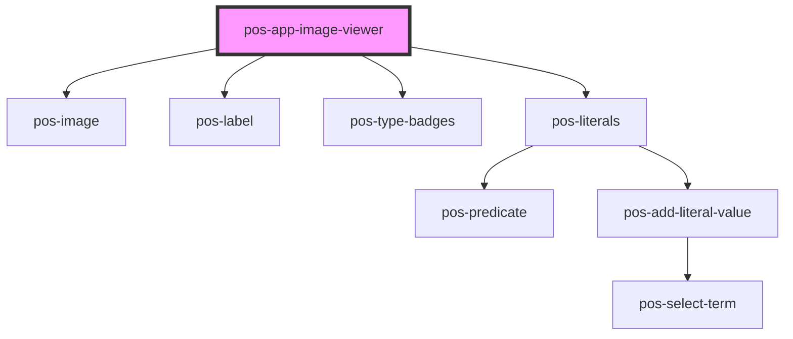

# pos-app-image-viewer

<!-- Auto Generated Below -->

## Events

| Event             | Description | Type               |
| ----------------- | ----------- | ------------------ |
| `pod-os:resource` |             | `CustomEvent<any>` |

## Dependencies

### Depends on

- [pos-image](../../components/pos-image)
- [pos-label](../../components/pos-label)
- [pos-type-badges](../../components/pos-type-badges)
- [pos-literals](../../components/pos-literals)

### Graph

----------------------------------------------

*Built with [StencilJS](https://stenciljs.com/)*
