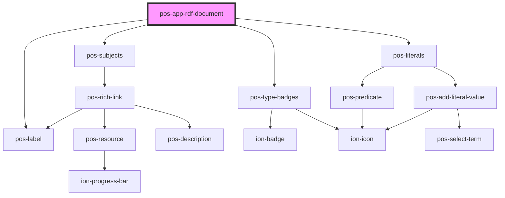

# pos-app-rdf-document

<!-- Auto Generated Below -->

## Dependencies

### Depends on

- [pos-subjects](../../components/pos-subjects)
- [pos-label](../../components/pos-label)
- [pos-type-badges](../../components/pos-type-badges)
- [pos-literals](../../components/pos-literals)

### Graph

----------------------------------------------

*Built with [StencilJS](https://stenciljs.com/)*
