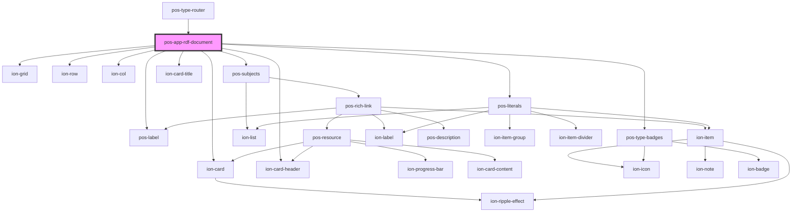

# pos-app-rdf-document

<!-- Auto Generated Below -->

## Dependencies

### Used by

 - [pos-type-router](../../components/pos-type-router)

### Depends on

- ion-grid
- ion-row
- ion-col
- [pos-subjects](../../components/pos-subjects)
- ion-card
- ion-card-header
- ion-card-title
- [pos-label](../../components/pos-label)
- [pos-type-badges](../../components/pos-type-badges)
- [pos-literals](../../components/pos-literals)

### Graph

----------------------------------------------

*Built with [StencilJS](https://stenciljs.com/)*
