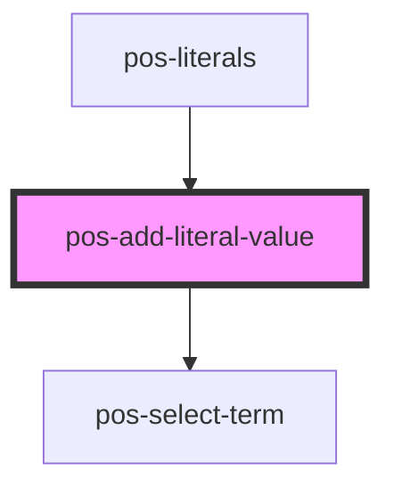

# pos-add-literal-value

<!-- Auto Generated Below -->

## Events

| Event                        | Description                                                                                  | Type               |
| ---------------------------- | -------------------------------------------------------------------------------------------- | ------------------ |
| `pod-os:added-literal-value` | The entered literal value has been added to the resource and successfully stored to the Pod. | `CustomEvent<any>` |
| `pod-os:error`               | Something went wrong while adding the literal value.                                         | `CustomEvent<any>` |
| `pod-os:init`                |                                                                                              | `CustomEvent<any>` |
| `pod-os:resource`            |                                                                                              | `CustomEvent<any>` |

## Dependencies

### Used by

 - [pos-literals](../pos-literals)

### Depends on

- [pos-select-term](../pos-select-term)

### Graph

----------------------------------------------

*Built with [StencilJS](https://stenciljs.com/)*
