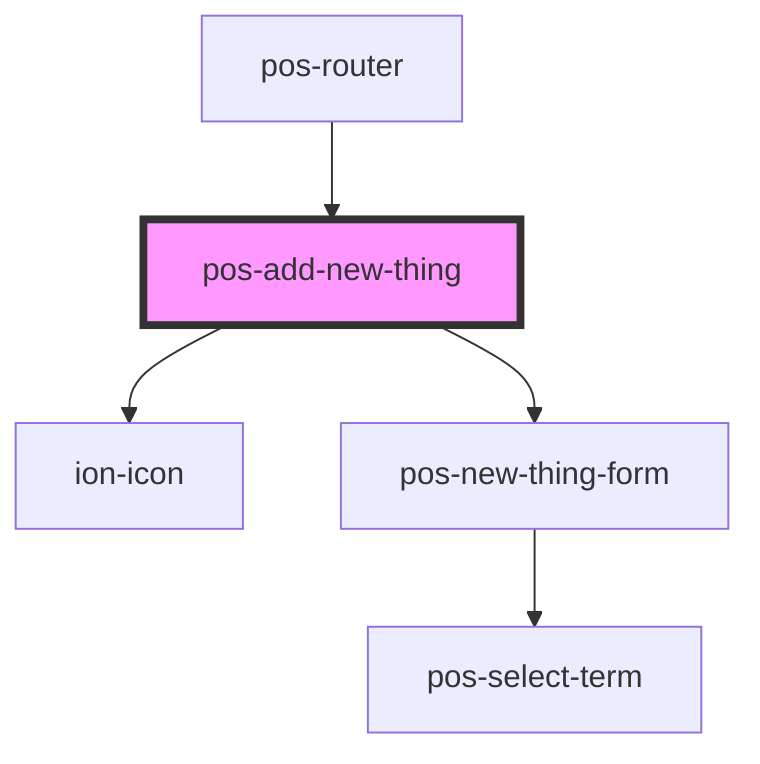

# pos-add-new-thing

<!-- Auto Generated Below -->

## Properties

| Property                    | Attribute       | Description | Type     | Default     |
| --------------------------- | --------------- | ----------- | -------- | ----------- |
| `referenceUri` _(required)_ | `reference-uri` |             | `string` | `undefined` |

## Dependencies

### Used by

 - [pos-router](../pos-router)

### Depends on

- ion-icon
- [pos-new-thing-form](../pos-new-thing-form)

### Graph

----------------------------------------------

*Built with [StencilJS](https://stenciljs.com/)*
