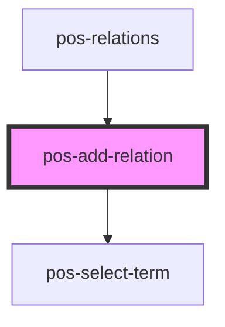

# pos-add-relation

<!-- Auto Generated Below -->

## Overview

Add a new relation from the current resource to another one

## Events

| Event                   | Description                                                                     | Type                    |
| ----------------------- | ------------------------------------------------------------------------------- | ----------------------- |
| `pod-os:added-relation` | The relation has been added to the resource and successfully stored to the Pod. | `CustomEvent<Relation>` |
| `pod-os:error`          | Something went wrong while adding the relation.                                 | `CustomEvent<any>`      |

## Dependencies

### Used by

 - [pos-relations](../pos-relations)

### Depends on

- [pos-select-term](../pos-select-term)

### Graph

----------------------------------------------

*Built with [StencilJS](https://stenciljs.com/)*
