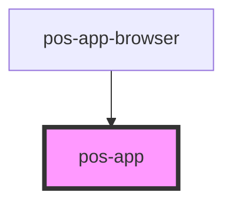

# pos-app

<!-- Auto Generated Below -->

## Properties

| Property                 | Attribute                  | Description | Type      | Default |
| ------------------------ | -------------------------- | ----------- | --------- | ------- |
| `restorePreviousSession` | `restore-previous-session` |             | `boolean` | `false` |

## Events

| Event                     | Description                                                                                                                                                                                                                          | Type                                                                                                                    |
| ------------------------- | ------------------------------------------------------------------------------------------------------------------------------------------------------------------------------------------------------------------------------------ | ----------------------------------------------------------------------------------------------------------------------- |
| `pod-os:loaded`           | Fires as soon as the pos-app DOM element has been loaded and PodOS can be used. Note: In case the user is authenticated, this will fire before profile data of the user has been fetched, but after authentication has been handled. | `CustomEvent<{ os: PodOS; authenticatedFetch: (input: URL \| RequestInfo, init?: RequestInit) => Promise<Response>; }>` |
| `pod-os:session-restored` | Fired whenever the session was restored                                                                                                                                                                                              | `CustomEvent<{ url: string; }>`                                                                                         |

## Dependencies

### Used by

 - [pos-app-browser](../../apps/pos-app-browser)

### Graph

----------------------------------------------

*Built with [StencilJS](https://stenciljs.com/)*
