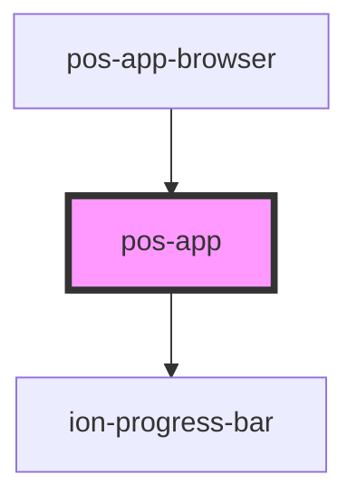

# pos-app

<!-- Auto Generated Below -->

## Properties

| Property                 | Attribute                  | Description | Type      | Default |
| ------------------------ | -------------------------- | ----------- | --------- | ------- |
| `restorePreviousSession` | `restore-previous-session` |             | `boolean` | `false` |

## Events

| Event                     | Description                             | Type                            |
| ------------------------- | --------------------------------------- | ------------------------------- |
| `pod-os:session-restored` | Fired whenever the session was restored | `CustomEvent<{ url: string; }>` |

## Dependencies

### Used by

 - [pos-app-browser](../../apps/pos-app-browser)

### Depends on

- ion-progress-bar

### Graph

----------------------------------------------

*Built with [StencilJS](https://stenciljs.com/)*
