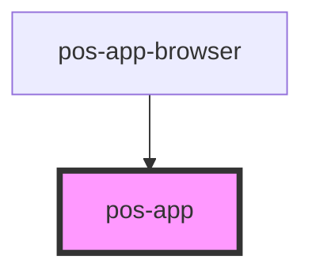

# pos-app

<!-- Auto Generated Below -->

## Events

| Event                    | Description                                                     | Type                                     |
| ------------------------ | --------------------------------------------------------------- | ---------------------------------------- |
| `pod-os:login`           | Fires after a user has been authenticated successfully          | `CustomEvent<LoginEvent>`                |
| `pod-os:logout`          | Fires after a user signed out                                   | `CustomEvent<LogoutEvent>`               |
| `pod-os:session-changed` | Fired whenever the session login state changes (login / logout) | `CustomEvent<LoginEvent \| LogoutEvent>` |

## Dependencies

### Used by

 - [pos-app-browser](../../apps/pos-app-browser)

### Graph

----------------------------------------------

*Built with [StencilJS](https://stenciljs.com/)*
