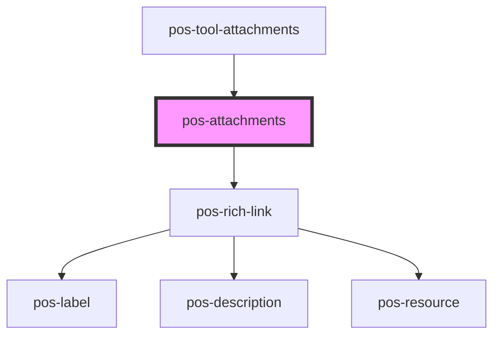

# pos-attachments

<!-- Auto Generated Below -->

## Overview

Lists whatever is attached to the current thing

## Methods

### `addToList(attachment: Attachment) => Promise<void>`

Adds an attachment visually to the list of attachments.
This only adds an entry to the list, it does not actually upload the attachment.
It is meant to be used after an attachment has been uploaded to update the view.

#### Parameters

| Name         | Type         | Description                        |
| ------------ | ------------ | ---------------------------------- |
| `attachment` | `Attachment` | The attachment to add to the list. |

#### Returns

Type: `Promise<void>`

## Dependencies

### Used by

 - [pos-tool-attachments](../../tools/pos-tool-attachments)

### Depends on

- [pos-rich-link](../pos-rich-link)

### Graph

----------------------------------------------

*Built with [StencilJS](https://stenciljs.com/)*
