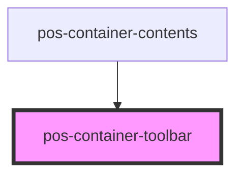

# pos-container-toolbar

<!-- Auto Generated Below -->

## Events

| Event                      | Description | Type                |
| -------------------------- | ----------- | ------------------- |
| `pod-os:create-new-file`   |             | `CustomEvent<void>` |
| `pod-os:create-new-folder` |             | `CustomEvent<void>` |

## Dependencies

### Used by

 - [pos-container-contents](..)

### Graph

----------------------------------------------

*Built with [StencilJS](https://stenciljs.com/)*
