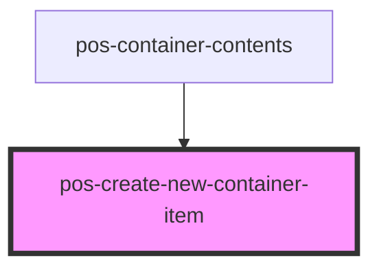

# pos-create-new-container-item

<!-- Auto Generated Below -->

## Properties

| Property                 | Attribute | Description | Type                 | Default     |
| ------------------------ | --------- | ----------- | -------------------- | ----------- |
| `container` _(required)_ | --        |             | `LdpContainer`       | `undefined` |
| `type` _(required)_      | `type`    |             | `"file" \| "folder"` | `undefined` |

## Events

| Event          | Description | Type                   |
| -------------- | ----------- | ---------------------- |
| `pod-os:error` |             | `CustomEvent<Problem>` |
| `pod-os:link`  |             | `CustomEvent<string>`  |

## Dependencies

### Used by

 - [pos-container-contents](..)

### Graph

----------------------------------------------

*Built with [StencilJS](https://stenciljs.com/)*
