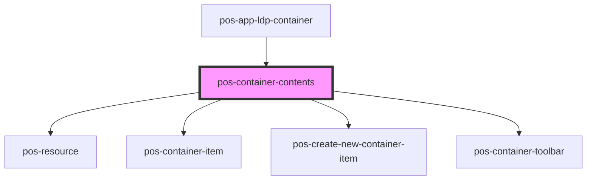

# pos-container-contents

<!-- Auto Generated Below -->

## Events

| Event             | Description | Type               |
| ----------------- | ----------- | ------------------ |
| `pod-os:resource` |             | `CustomEvent<any>` |

## Dependencies

### Used by

 - [pos-app-ldp-container](../../apps/pos-app-ldp-container)

### Depends on

- [pos-resource](../pos-resource)
- [pos-container-item](pos-container-item)
- [pos-create-new-container-item](pos-create-new-container-item)
- [pos-container-toolbar](pos-container-toolbar)

### Graph

----------------------------------------------

*Built with [StencilJS](https://stenciljs.com/)*
