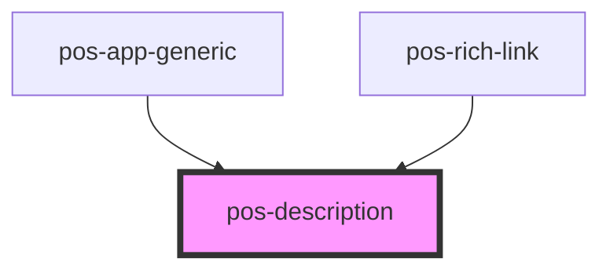

# pos-description

<!-- Auto Generated Below -->

## Overview

Displays a description of the resource, as provided by [Thing.description()](https://pod-os.org/reference/core/classes/thing/#description).

Re-renders when data in the store changes using [Thing.observeDescription()](https://pod-os.org/reference/core/classes/thing/#observeDescription).

## Events

| Event             | Description | Type               |
| ----------------- | ----------- | ------------------ |
| `pod-os:resource` |             | `CustomEvent<any>` |

## Dependencies

### Used by

 - [pos-app-generic](../../apps/pos-app-generic)
 - [pos-rich-link](../pos-rich-link)

### Graph

----------------------------------------------

*Built with [StencilJS](https://stenciljs.com/)*
