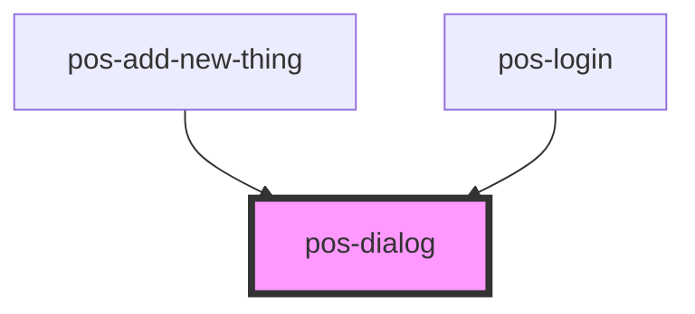

# pos-dialog

<!-- Auto Generated Below -->

## Overview

Styled wrapper around native dialog element, with slots `title` and `content`

## Methods

### `close() => Promise<void>`

#### Returns

Type: `Promise<void>`

### `showModal() => Promise<void>`

#### Returns

Type: `Promise<void>`

## Dependencies

### Used by

 - [pos-add-new-thing](../pos-add-new-thing)
 - [pos-login](../pos-login)

### Graph

----------------------------------------------

*Built with [StencilJS](https://stenciljs.com/)*
