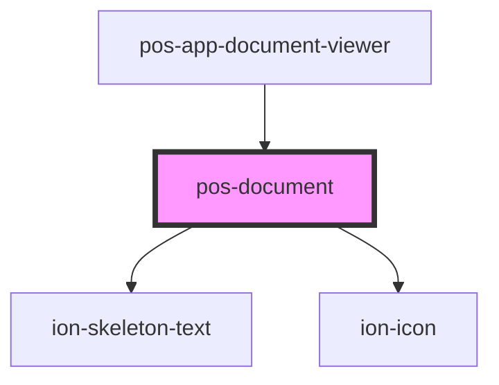

# pos-document

<!-- Auto Generated Below -->

## Properties

| Property | Attribute | Description | Type     | Default     |
| -------- | --------- | ----------- | -------- | ----------- |
| `alt`    | `alt`     |             | `string` | `undefined` |
| `src`    | `src`     |             | `string` | `undefined` |

## Events

| Event         | Description | Type               |
| ------------- | ----------- | ------------------ |
| `pod-os:init` |             | `CustomEvent<any>` |

## Dependencies

### Used by

 - [pos-app-document-viewer](../../apps/pos-app-document-viewer)

### Depends on

- ion-skeleton-text
- ion-icon

### Graph

----------------------------------------------

*Built with [StencilJS](https://stenciljs.com/)*
