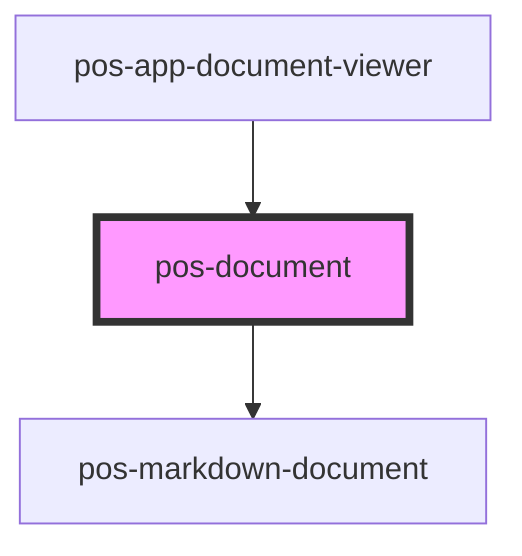

# pos-document

<!-- Auto Generated Below -->

## Properties

| Property | Attribute | Description | Type     | Default     |
| -------- | --------- | ----------- | -------- | ----------- |
| `alt`    | `alt`     |             | `string` | `undefined` |
| `src`    | `src`     |             | `string` | `undefined` |

## Events

| Event                    | Description                                                          | Type                  |
| ------------------------ | -------------------------------------------------------------------- | --------------------- |
| `pod-os:error`           | Emitted when an error occurs during file operations.                 | `CustomEvent<Error>`  |
| `pod-os:init`            |                                                                      | `CustomEvent<any>`    |
| `pod-os:resource-loaded` | Indicates that the resource given in `src` property has been loaded. | `CustomEvent<string>` |

## Dependencies

### Used by

 - [pos-app-document-viewer](../../apps/pos-app-document-viewer)

### Depends on

- [pos-markdown-document](../pos-markdown-document)

### Graph

----------------------------------------------

*Built with [StencilJS](https://stenciljs.com/)*
