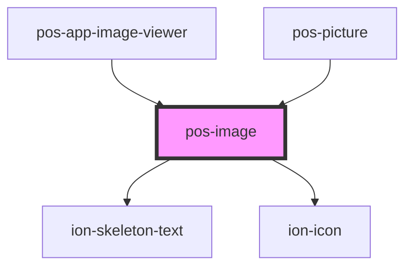

# pos-image

<!-- Auto Generated Below -->

## Overview

Tries fetch an image with the solid authentication, and can visualize http errors like 403 or 404 if this fails.
Falls back to classic  on network errors like CORS.
Renders a normal link if even this fails.

## Properties

| Property | Attribute | Description | Type     | Default     |
| -------- | --------- | ----------- | -------- | ----------- |
| `alt`    | `alt`     |             | `string` | `undefined` |
| `src`    | `src`     |             | `string` | `undefined` |

## Events

| Event                    | Description                                                          | Type                  |
| ------------------------ | -------------------------------------------------------------------- | --------------------- |
| `pod-os:init`            |                                                                      | `CustomEvent<any>`    |
| `pod-os:resource-loaded` | Indicates that the resource given in `src` property has been loaded. | `CustomEvent<string>` |

## CSS Custom Properties

| Name              | Description                 |
| ----------------- | --------------------------- |
| `--border-radius` | Border radius of the image  |
| `--height`        | Height of the image         |
| `--max-height`    | Maximum height of the image |
| `--max-width`     | Maximum width of the image  |
| `--object-fit`    | CSS object-fit of the image |
| `--width`         | Width of the image          |

## Dependencies

### Used by

 - [pos-app-image-viewer](../../apps/pos-app-image-viewer)
 - [pos-picture](../pos-picture)

### Depends on

- ion-skeleton-text
- ion-icon

### Graph

----------------------------------------------

*Built with [StencilJS](https://stenciljs.com/)*
