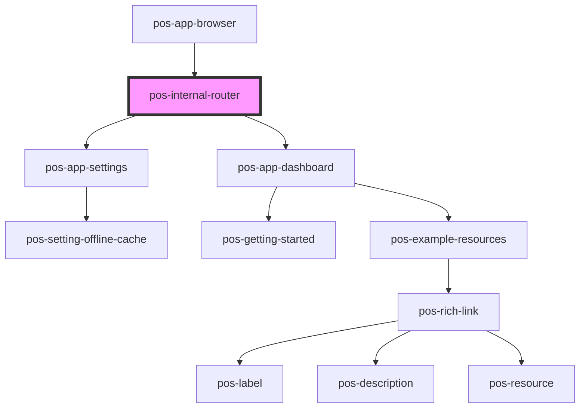

# pos-internal-router

<!-- Auto Generated Below -->

## Properties

| Property | Attribute | Description | Type     | Default              |
| -------- | --------- | ----------- | -------- | -------------------- |
| `uri`    | `uri`     |             | `string` | `'pod-os:dashboard'` |

## Dependencies

### Used by

 - [pos-app-browser](../../apps/pos-app-browser)

### Depends on

- [pos-app-settings](../../apps/pos-app-settings)
- [pos-app-dashboard](../../apps/pos-app-dashboard)

### Graph

----------------------------------------------

*Built with [StencilJS](https://stenciljs.com/)*
