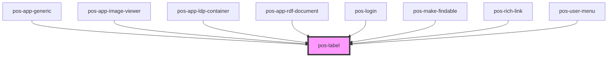

# pos-label

<!-- Auto Generated Below -->

## Overview

Displays a human-readable label of the resource, provided by [Thing.label()](https://pod-os.org/reference/core/classes/thing/#label)

## Events

| Event             | Description | Type               |
| ----------------- | ----------- | ------------------ |
| `pod-os:resource` |             | `CustomEvent<any>` |

## Dependencies

### Used by

 - [pos-app-generic](../../apps/pos-app-generic)
 - [pos-app-image-viewer](../../apps/pos-app-image-viewer)
 - [pos-app-ldp-container](../../apps/pos-app-ldp-container)
 - [pos-app-rdf-document](../../apps/pos-app-rdf-document)
 - [pos-login](../pos-login)
 - [pos-make-findable](../pos-make-findable)
 - [pos-rich-link](../pos-rich-link)
 - [pos-user-menu](../pos-user-menu)

### Graph

----------------------------------------------

*Built with [StencilJS](https://stenciljs.com/)*
