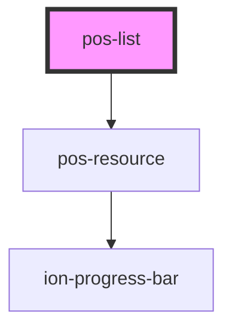

# pos-list

<!-- Auto Generated Below -->

## Properties

| Property   | Attribute   | Description                                                       | Type      | Default     |
| ---------- | ----------- | ----------------------------------------------------------------- | --------- | ----------- |
| `fetch`    | `fetch`     | Whether listed resources should be fetched before being displayed | `boolean` | `false`     |
| `ifTypeof` | `if-typeof` | URI of a class for which instances will be listed                 | `string`  | `undefined` |
| `rel`      | `rel`       | URI of the predicate to follow                                    | `string`  | `undefined` |

## Events

| Event             | Description | Type               |
| ----------------- | ----------- | ------------------ |
| `pod-os:init`     |             | `CustomEvent<any>` |
| `pod-os:resource` |             | `CustomEvent<any>` |

## Dependencies

### Depends on

- [pos-resource](../pos-resource)

### Graph

----------------------------------------------

*Built with [StencilJS](https://stenciljs.com/)*
