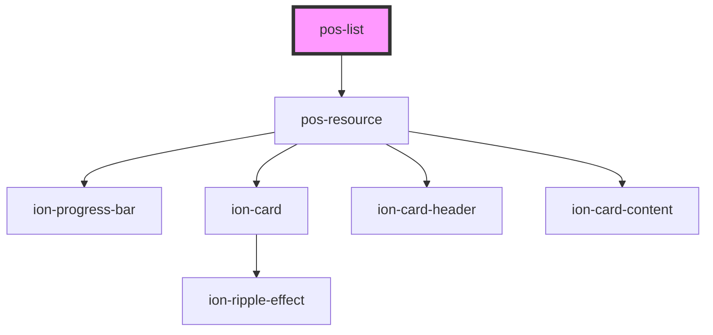

<!-- Auto Generated Below -->

## Properties

| Property | Attribute | Description                    | Type     | Default     |
| -------- | --------- | ------------------------------ | -------- | ----------- |
| `rel`    | `rel`     | URI of the predicate to follow | `string` | `undefined` |

## Events

| Event             | Description | Type               |
| ----------------- | ----------- | ------------------ |
| `pod-os:resource` |             | `CustomEvent<any>` |

## Dependencies

### Depends on

- [pos-resource](../pos-resource)

### Graph

----------------------------------------------

*Built with [StencilJS](https://stenciljs.com/)*
