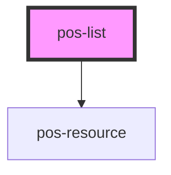

# pos-list

<!-- Auto Generated Below -->

## Overview

Renders a template for each resource in a list. The list is either defined by a relation from the parent resource
or by a class for which instances will be listed.

`pos-list` must contain a `<template>` as a single child component. This template will be used to render each resource
in the list. All PodOS elements within this template will receive the listed resource as their context, e.g. a `pos-label`
will then render the label of each list item.

## Properties

| Property   | Attribute   | Description                                                       | Type      | Default     |
| ---------- | ----------- | ----------------------------------------------------------------- | --------- | ----------- |
| `fetch`    | `fetch`     | Whether listed resources should be fetched before being displayed | `boolean` | `false`     |
| `ifTypeof` | `if-typeof` | URI of a class for which instances will be listed                 | `string`  | `undefined` |
| `rel`      | `rel`       | URI of the predicate to follow                                    | `string`  | `undefined` |

## Events

| Event             | Description | Type               |
| ----------------- | ----------- | ------------------ |
| `pod-os:init`     |             | `CustomEvent<any>` |
| `pod-os:resource` |             | `CustomEvent<any>` |

## Dependencies

### Depends on

- [pos-resource](../pos-resource)

### Graph

```mermaid
graph TD;
  pos-list --> pos-resource
  style pos-list fill:#f9f,stroke:#333,stroke-width:4px
```

----------------------------------------------

*Built with [StencilJS](https://stenciljs.com/)*
