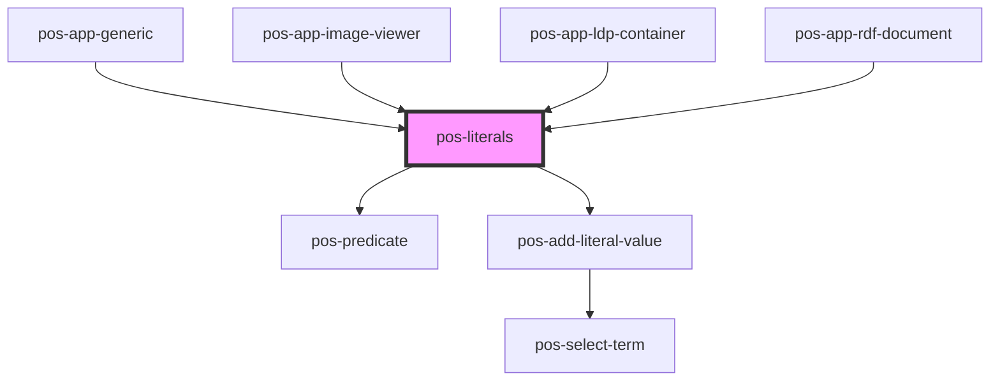

# pos-literals

<!-- Auto Generated Below -->

## Events

| Event             | Description | Type               |
| ----------------- | ----------- | ------------------ |
| `pod-os:resource` |             | `CustomEvent<any>` |

## Dependencies

### Used by

 - [pos-app-generic](../../apps/pos-app-generic)
 - [pos-app-image-viewer](../../apps/pos-app-image-viewer)
 - [pos-app-ldp-container](../../apps/pos-app-ldp-container)
 - [pos-app-rdf-document](../../apps/pos-app-rdf-document)

### Depends on

- [pos-predicate](../pos-predicate)
- [pos-add-literal-value](../pos-add-literal-value)

### Graph

----------------------------------------------

*Built with [StencilJS](https://stenciljs.com/)*
