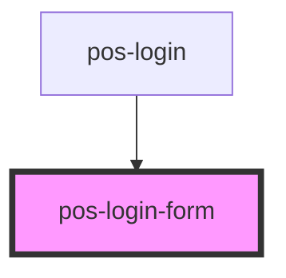

# pos-login-form

<!-- Auto Generated Below -->

## Events

| Event                     | Description                                 | Type               |
| ------------------------- | ------------------------------------------- | ------------------ |
| `pod-os:idp-url-selected` | Emits the selected IDP URL to use for login | `CustomEvent<any>` |

## Dependencies

### Used by

 - [pos-login](../pos-login)

### Graph

----------------------------------------------

*Built with [StencilJS](https://stenciljs.com/)*
