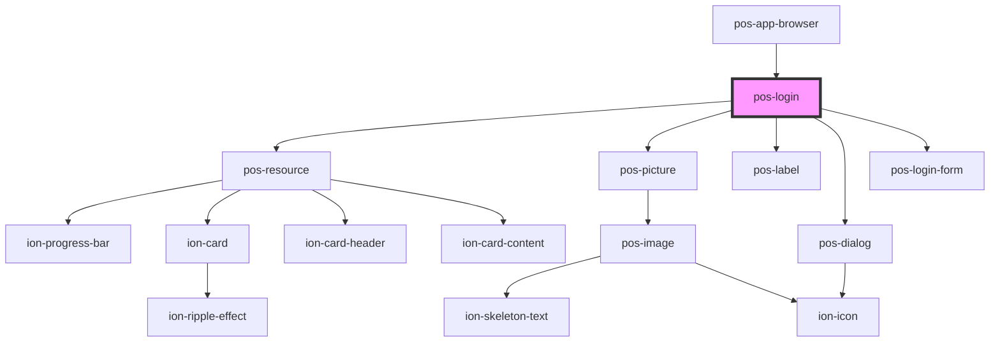

# pos-login

<!-- Auto Generated Below -->

## Events

| Event         | Description | Type               |
| ------------- | ----------- | ------------------ |
| `pod-os:init` |             | `CustomEvent<any>` |

## Dependencies

### Used by

 - [pos-app-browser](../../apps/pos-app-browser)

### Depends on

- [pos-resource](../pos-resource)
- [pos-picture](../pos-picture)
- [pos-label](../pos-label)
- [pos-dialog](../pos-dialog)
- [pos-login-form](../pos-login-form)

### Graph

----------------------------------------------

*Built with [StencilJS](https://stenciljs.com/)*
