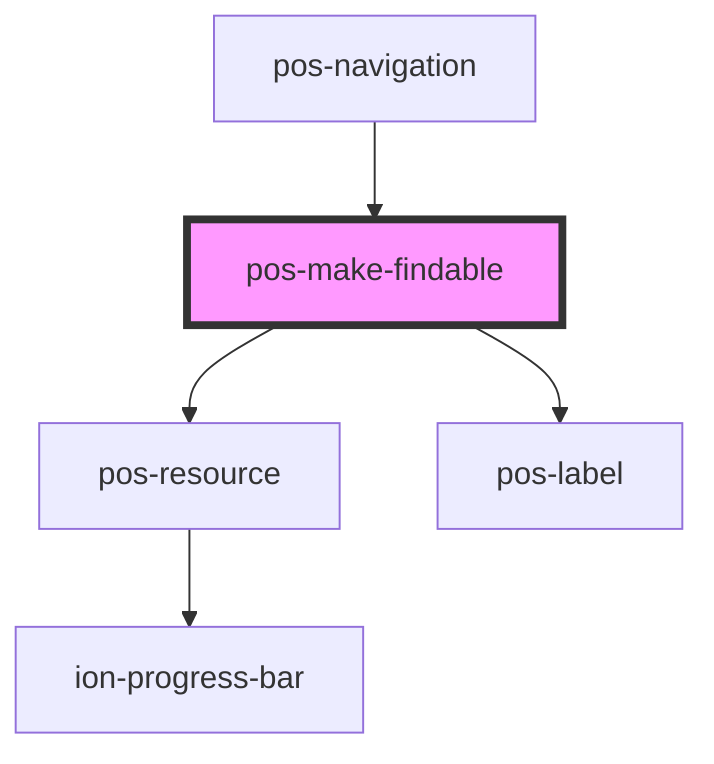

<!-- Auto Generated Below -->

## Properties

| Property           | Attribute | Description | Type     | Default     |
| ------------------ | --------- | ----------- | -------- | ----------- |
| `uri` _(required)_ | `uri`     |             | `string` | `undefined` |

## Events

| Event                         | Description | Type               |
| ----------------------------- | ----------- | ------------------ |
| `pod-os:error`                |             | `CustomEvent<any>` |
| `pod-os:init`                 |             | `CustomEvent<any>` |
| `pod-os:search:index-created` |             | `CustomEvent<any>` |
| `pod-os:search:index-updated` |             | `CustomEvent<any>` |

## Dependencies

### Used by

 - [pos-navigation](../pos-navigation)

### Depends on

- [pos-resource](../pos-resource)
- [pos-label](../pos-label)

### Graph

----------------------------------------------

*Built with [StencilJS](https://stenciljs.com/)*
