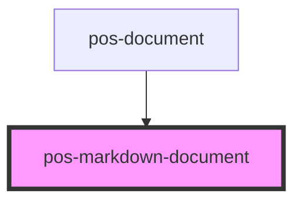

# pos-markdown-document

<!-- Auto Generated Below -->

## Properties

| Property       | Attribute       | Description                                                  | Type        | Default     |
| -------------- | --------------- | ------------------------------------------------------------ | ----------- | ----------- |
| `editable`     | `editable`      | Whether the current user has the permission to edit the file | `boolean`   | `false`     |
| `file`         | --              | The file to show / edit                                      | `SolidFile` | `undefined` |
| `savingFailed` | `saving-failed` | Whether saving the latest changes failed                     | `boolean`   | `false`     |

## Events

| Event                      | Description                                       | Type                        |
| -------------------------- | ------------------------------------------------- | --------------------------- |
| `pod-os:document-modified` | Event emitted when the document has been modified | `CustomEvent<ModifiedFile>` |

## Methods

### `startEditing() => Promise<void>`

Switch to editing mode

#### Returns

Type: `Promise<void>`

### `stopEditing() => Promise<void>`

Switch to view mode

#### Returns

Type: `Promise<void>`

## Dependencies

### Used by

 - [pos-document](../pos-document)

### Graph

----------------------------------------------

*Built with [StencilJS](https://stenciljs.com/)*
