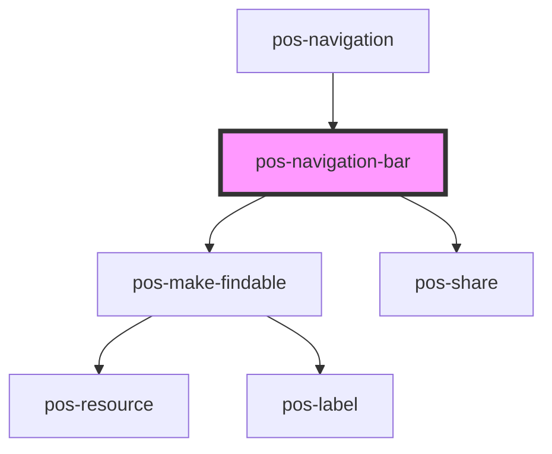

# pos-navigation-bar

<!-- Auto Generated Below -->

## Properties

| Property           | Attribute            | Description | Type      | Default     |
| ------------------ | -------------------- | ----------- | --------- | ----------- |
| `current`          | --                   |             | `Thing`   | `undefined` |
| `searchIndexReady` | `search-index-ready` |             | `boolean` | `undefined` |

## Events

| Event             | Description | Type               |
| ----------------- | ----------- | ------------------ |
| `pod-os:navigate` |             | `CustomEvent<any>` |

## Dependencies

### Used by

 - [pos-navigation](..)

### Depends on

- [pos-make-findable](../../pos-make-findable)
- [pos-share](../../pos-share)

### Graph

----------------------------------------------

*Built with [StencilJS](https://stenciljs.com/)*
