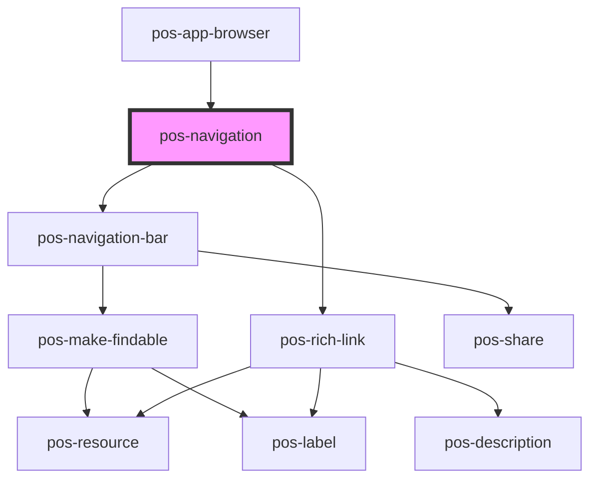

# pos-navigation

<!-- Auto Generated Below -->

## Properties

| Property | Attribute | Description                         | Type     | Default |
| -------- | --------- | ----------------------------------- | -------- | ------- |
| `uri`    | `uri`     | Initial value of the navigation bar | `string` | `''`    |

## Events

| Event         | Description | Type               |
| ------------- | ----------- | ------------------ |
| `pod-os:init` |             | `CustomEvent<any>` |
| `pod-os:link` |             | `CustomEvent<any>` |

## Dependencies

### Used by

 - [pos-app-browser](../../apps/pos-app-browser)

### Depends on

- [pos-navigation-bar](bar)
- [pos-rich-link](../pos-rich-link)

### Graph

----------------------------------------------

*Built with [StencilJS](https://stenciljs.com/)*
