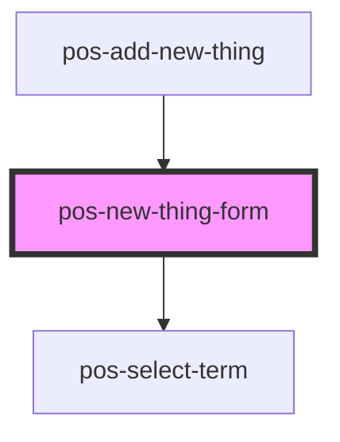

# pos-new-thing-form

<!-- Auto Generated Below -->

## Properties

| Property                    | Attribute       | Description | Type     | Default     |
| --------------------------- | --------------- | ----------- | -------- | ----------- |
| `referenceUri` _(required)_ | `reference-uri` |             | `string` | `undefined` |

## Events

| Event         | Description | Type               |
| ------------- | ----------- | ------------------ |
| `pod-os:init` |             | `CustomEvent<any>` |

## Dependencies

### Used by

 - [pos-add-new-thing](../pos-add-new-thing)

### Depends on

- [pos-select-term](../pos-select-term)

### Graph

----------------------------------------------

*Built with [StencilJS](https://stenciljs.com/)*
