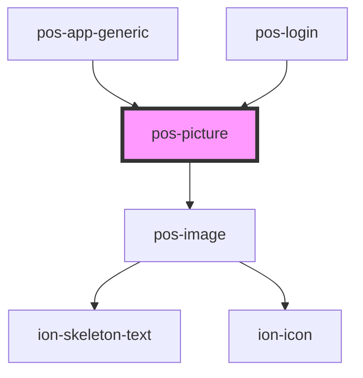

# pos-picture

<!-- Auto Generated Below -->

## Events

| Event             | Description | Type               |
| ----------------- | ----------- | ------------------ |
| `pod-os:resource` |             | `CustomEvent<any>` |

## CSS Custom Properties

| Name              | Description                  |
| ----------------- | ---------------------------- |
| `--border-radius` | Border radius of the picture |
| `--height`        | Height of the picture        |
| `--width`         | Width of the picture         |

## Dependencies

### Used by

 - [pos-app-generic](../../apps/pos-app-generic)
 - [pos-login](../pos-login)

### Depends on

- [pos-image](../pos-image)

### Graph

----------------------------------------------

*Built with [StencilJS](https://stenciljs.com/)*
