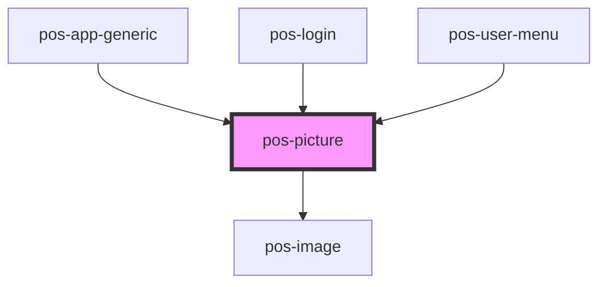

# pos-picture

<!-- Auto Generated Below -->

## Properties

| Property            | Attribute            | Description                                                                                                      | Type      | Default |
| ------------------- | -------------------- | ---------------------------------------------------------------------------------------------------------------- | --------- | ------- |
| `blurredBackground` | `blurred-background` | Use a blurred version of the image as its own background, if the image is scaled down to fit into the container. | `boolean` | `false` |

## Events

| Event             | Description | Type               |
| ----------------- | ----------- | ------------------ |
| `pod-os:resource` |             | `CustomEvent<any>` |

## CSS Custom Properties

| Name              | Description                   |
| ----------------- | ----------------------------- |
| `--border-radius` | Border radius of the picture  |
| `--height`        | Height of the picture         |
| `--object-fit`    | CSS object-fit of the picture |
| `--width`         | Width of the picture          |

## Dependencies

### Used by

 - [pos-app-generic](../../apps/pos-app-generic)
 - [pos-login](../pos-login)
 - [pos-user-menu](../pos-user-menu)

### Depends on

- [pos-image](../pos-image)

### Graph

----------------------------------------------

*Built with [StencilJS](https://stenciljs.com/)*
